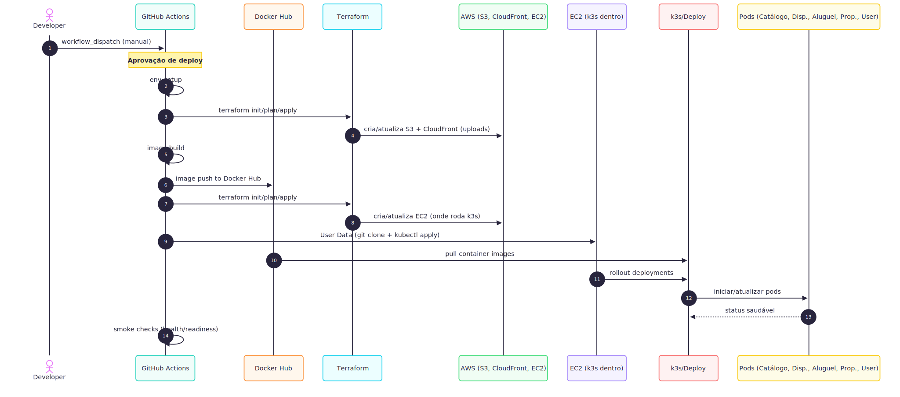

# 🏠 Plataforma de Aluguel e Locação de Escritórios

Este repositório contém o desenvolvimento de uma plataforma web voltada à intermediação de **aluguel e locação de espaços de trabalho**, como escritórios, salas e coworkings.

Este projeto foi desenvolvido como parte da avaliação semestral das disciplinas:

- **ECM516 - Arquitetura de Sistemas Computacionais**
- **ECM252 - Linguagens de Programação II**

---

## 🎯 Objetivo do Projeto

O sistema tem como objetivo permitir que clientes possam **alugar espaços** por período e capacidade desejada, enquanto outros usuários possam **disponibilizar seus imóveis** para locação, passando por uma etapa de pré-vistoria e vistoria técnica realizada por uma empresa parceira.

Além de seu propósito funcional, o sistema serve como aplicação prática de conceitos como:

- Arquitetura baseada em **microsserviços**
- Comunicação assíncrona com **barramento de eventos**
- Interface web moderna com **React e TypeScript**
- Backend estruturado com **Node.js**

---

## 💡 Visão Geral das Funcionalidades

- **Cadastro e login** com dados pessoais e autenticação segura
- **Exploração de imóveis** disponíveis para aluguel com filtros por localização, capacidade e datas
- **Página de detalhes do imóvel**, incluindo fotos, descrição, estrutura e comodidades
- **Processo de aluguel**, com definição do período e direcionamento ao gateway de pagamento
- **Visualização de imóveis alugados**, com histórico e geração de código de acesso no início da estadia
- **Cadastro de imóveis para locação**, com pré-vistoria e agendamento de vistoria
- **Acompanhamento do status dos imóveis locados**, incluindo reprovações com justificativas
- **Interface exclusiva para vistoriadores**, com site gerado automaticamente para avaliação do imóvel

---

## 🛠️ Tecnologias Utilizadas

- **Frontend:** React, TypeScript (TSX), TailwindCSS
- **Backend:** Node.js, Express, Typescript, Docker, K8s
- **Infra:** Terraform, AWS
- **Comunicação entre serviços**: RabbitMQ

---

## 🗺️ Diagramas

*Figura 1: Arquitetura do projeto*

*Figura 2: Fluxo de deploy*

---

## 📚 Documentação da API

A coleção completa de endpoints, exemplos de requisições e esquemas de resposta está disponível no Postman:

[Documentação](https://documenter.getpostman.com/view/31820328/2sB2qXk31Q)

---

## 📅 Kanban do projeto

Para garantir um gerenciamento visual e eficiente das tarefas, adotamos a metodologia ágil Kanban. Através dela, acompanhamos o progresso de cada etapa do desenvolvimento de forma colaborativa e transparente.

➡️ Acesse nosso quadro Kanban no GitHub para visualizar o andamento do projeto:

[Kanban](https://github.com/orgs/WorkUpMaua/projects/1/views/1)

---

## 🤝 Integrantes

- [João Paulo Bonagurio Ramirez](https://github.com/yJony)           | 22.01247-8
- [Lucas Milani Thomsen Galhardo](https://github.com/LucasKiller)    | 22.00818-7   🤪🔪
- [Lucas Olivares Borges da Silva](https://github.com/lvcasolivares) | 22.00889-6
- [Luis Gustavo Gonçalves Machado](https://github.com/luisgmachado)  | 21.00322-0
- [Tiago Tadeu de Azevedo](https://github.com/tiagooazevedo)         | 22.00856-0
- [Victor Augusto de Gasperi](https://github.com/VictorGasperi)      | 22.00765-2 
